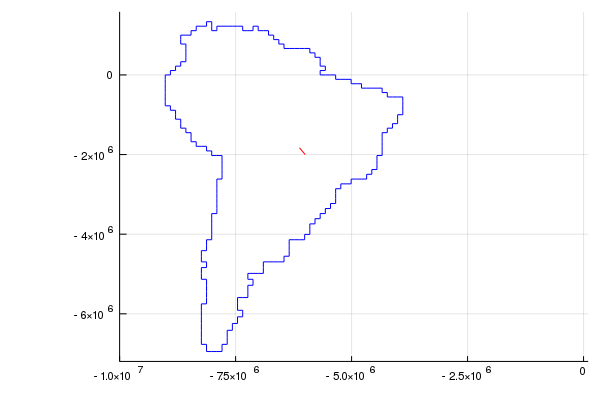

# [Feynman Kac formula](@id feynmankac)

The Feynman Kac formula is generally stated for terminal condition problems (see e.g. [Wikipedia](https://en.wikipedia.org/wiki/Feynman–Kac_formula)), where
```math
\partial_t u(t,x) + \mu(x) \nabla_x u(t,x) + \frac{1}{2} \sigma^2(x) \Delta_x u(t,x) + f(x, u(t,x))  = 0 \tag{1}
```
with terminal condition $u(T, x) = g(x)$, and $u \colon \R^d \to \R$. 

In this case the FK formula states that for all $t \in (0,T)$ it holds that

```math
u(t, x) = \int_t^T \mathbb{E} \left[ f(X^x_{s-t}, u(s, X^x_{s-t}))ds \right] + \mathbb{E} \left[ u(0, X^x_{T-t}) \right] \tag{2}
```
where 
```math
X_t^x = \int_0^t \mu(X_s^x)ds + \int_0^t\sigma(X_s^x)dB_s + x,
```
and $B_t$ is a [Brownian motion](https://en.wikipedia.org/wiki/Wiener_process).


Intuitively, this formula is motivated by the fact that [the density of Brownian particles (motion) satisfes the diffusion equation](https://en.wikipedia.org/wiki/Brownian_motion#Einstein's_theory).


The equivalence between the average trajectory of particles and PDEs given by the Feynman-Kac formula allows to overcome the curse of dimensionality that standard numerical methods suffer from, because the expectations can be approximated [Monte Carlo integrations]((https://en.wikipedia.org/wiki/Monte_Carlo_integration)), which approximation error decreases as $1/\sqrt{N}$ and is therefore not dependent on the dimensions. On the other hand, the computational complexity of traditional deterministic techniques grows exponentially in the number of dimensions. 

## Forward non-linear Feynman-Kac
> How to transform previous equation to an initial value problem?

Define $v(\tau, x) = u(T-\tau, x)$. Observe that $v(0,x) = u(T,x)$. Further observe that by the chain rule
```math
\begin{aligned}
\partial_\tau v(\tau, x) &= \partial_\tau u(T-\tau,x)\\
                        &= (\partial_\tau (T-\tau)) \partial_t u(T-\tau,x)\\
                        &= -\partial_t u(T-\tau, x).
\end{aligned}
```

From Eq. (1) we get that 
```math
- \partial_t u(T - \tau,x) = \mu(x) \nabla_x u(T - \tau,x) + \frac{1}{2} \sigma^2(x) \Delta_x u(T - \tau,x) + f(x, u(T - \tau,x)).
```
Replacing  $u(T-\tau, x)$ by $v(\tau, x)$ we get that $v$ satisfies
```math
\partial_\tau v(\tau, x) = \mu(x) \nabla_x v(\tau,x) + \frac{1}{2} \sigma^2(x) \Delta_x v(\tau,x) + f(x, v(\tau,x)) 
```
and from Eq. (2) we obtain

```math
v(\tau, x) = \int_{T-\tau}^T \mathbb{E} \left[ f(X^x_{s- T + \tau}, v(s, X^x_{s-T + \tau}))ds \right] + \mathbb{E} \left[ v(0, X^x_{\tau}) \right].
```
By using the substitution rule with $\tau \to \tau -T$ (shifting by T) and $\tau \to - \tau$ (inversing), and finally inversing the integral bound we get that 
```math
\begin{aligned}
v(\tau, x) &= \int_{-\tau}^0 \mathbb{E} \left[ f(X^x_{s + \tau}, v(s + T, X^x_{s + \tau}))ds \right] + \mathbb{E} \left[ v(0, X^x_{\tau}) \right]\\
            &= - \int_{\tau}^0 \mathbb{E} \left[ f(X^x_{\tau - s}, v(T-s, X^x_{\tau - s}))ds \right] + \mathbb{E} \left[ v(0, X^x_{\tau}) \right]\\
            &= \int_{0}^\tau \mathbb{E} \left[ f(X^x_{\tau - s}, v(T-s, X^x_{\tau - s}))ds \right] + \mathbb{E} \left[ v(0, X^x_{\tau}) \right].
\end{aligned}
```

This leads to the 
!!! info "Non-linear Feynman Kac for initial value problems"
    Consider the PDE
    ```math
    \partial_t u(t,x) = \mu(t, x) \nabla_x u(t,x) + \frac{1}{2} \sigma^2(t, x) \Delta_x u(t,x) + f(x, u(t,x))
    ```
    with initial conditions $u(0, x) = g(x)$, where $u \colon \R^d \to \R$. 
    Then
    ```math
    u(t, x) = \int_0^t \mathbb{E} \left[ f(X^x_{t - s}, u(T-s, X^x_{t - s}))ds \right] + \mathbb{E} \left[ u(0, X^x_t) \right] \tag{3}
    ```
    with 
    ```math
    X_t^x = \int_0^t \mu(X_s^x)ds + \int_0^t\sigma(X_s^x)dB_s + x.
    ```

## [Neumann Boundary conditions](@id neuman_bc)

Eq. (3) also applies to PDE problems with zero-flux boundary conditions (Neumann boundary conditions) on the domain $\Omega \in \R^d$, that is 
```math
\langle \nabla_x u(t,x) \cdot \vec{n} \rangle = 0
```
where $\vec{n}$ denotes the outer normal vector associated to $\Omega$, **if the stochastic particles $X_t^x$ are reflected at the boundary of the domains.**


